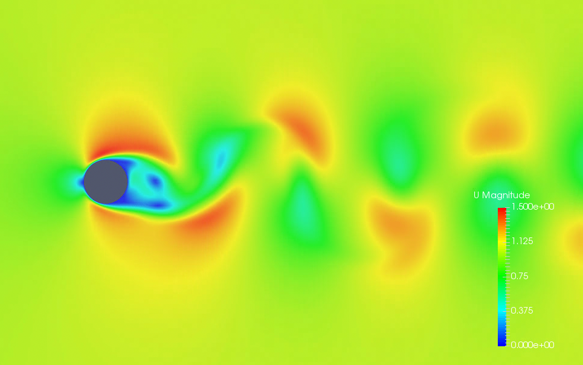

# Cylinder Vortex Shedding Simulation with OpenFoam
---
+ The Grid was firstly generated in GEOM(ESI-CFD), and exported as plot3d.
+ Pointwise accept the plot3d file and set BC conditions for OpenFoam and export the CAE file.
+ The diameter of the Cylinder is 2 meters, and kinematic viscosity is 0.01, that means Re=200.
+ icoFoam is applied and turbulance wasn't considered.
+ Screenshot of the result:
    + 
